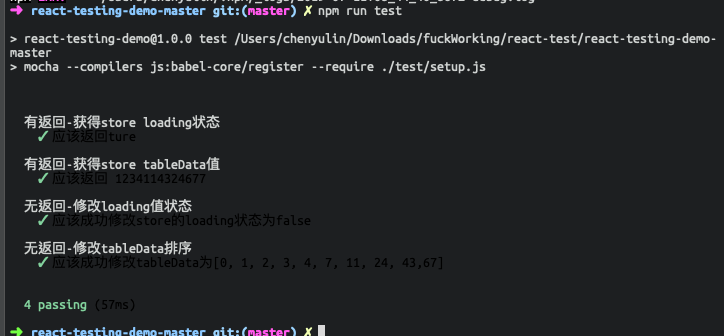
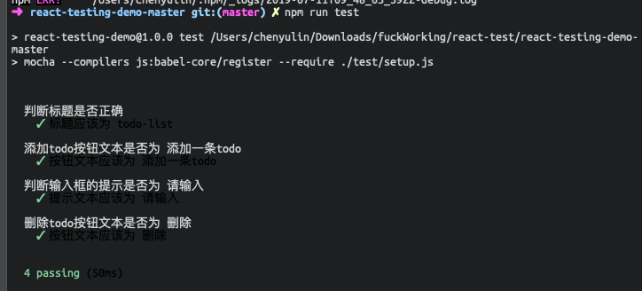
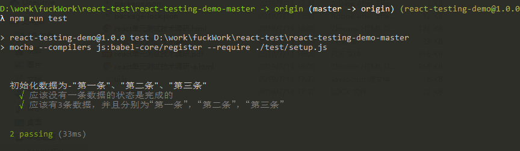
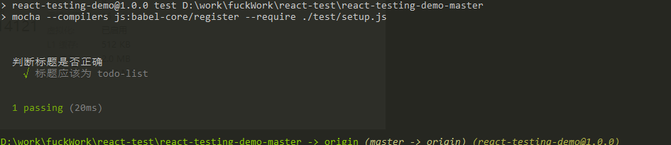
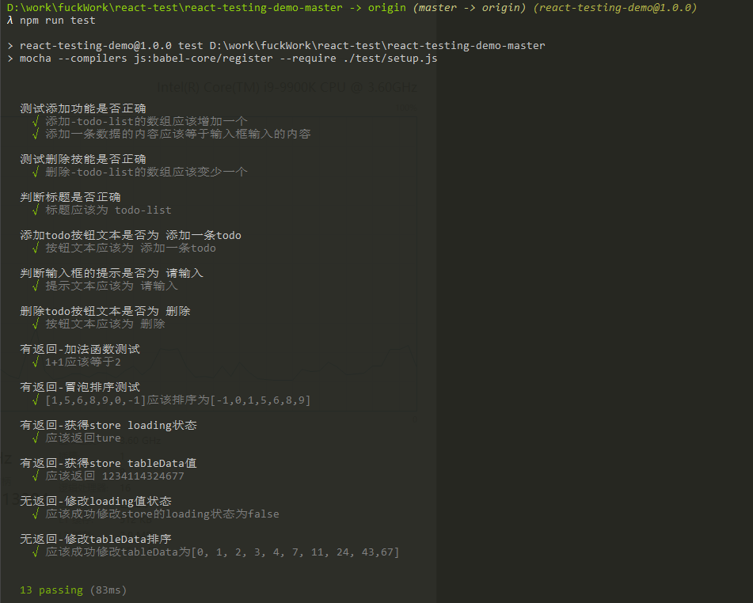
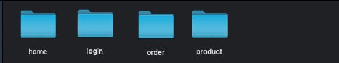

# 前端测试技术研究报告

## 文章目录

- 前言
- 前端测试包含的内容
  - 单元测试
  - UI 自动化测试
- 前端测试的意义
  - 单元测试的意义
  - UI 自动化测试的意义
- 单元测试
  - 单元测试是什么
  - 前端需要单元测试的部分
    - 函数测试
    - 组件测试
  - 编写测试用例的原则
  - react 测试工具链的选择
    - 测试工具库
      - 官方测试工具库 react-dom/test-utils
      - 第三方测试工具库 Enzyme
    - 测试框架
    - 小结
  - 单元测试包含的主要部分
    - 断言
    - 测试用例
  - 基于 Enzyme 的 react 单元测试实际体验
    - 功能简介
    - 函数测试
      - 具有返回值的函数测试
      - 没有返回值的函数测试
      - 小结
    - 组件测试
      - 组件基础测试-浅层渲染（**shallow**）
      - 组件 render，渲染纯 HTML
      - 组件深度渲染（**mount**）
      - 小结
    - 测试性能
    - 小结
  - 单元测试总结
    - 进行单元测试的优势
    - 进行单元测试的弊端
    - 单元测试结论
- UI 自动化测试
  - UI 自动化测试工具
  - 测试载体介绍
  - 实际载体测试
    - 测试点选取
    - 如何实现
    - 测试结果
  - UI 自动化测试总结
    - 进行 UI 自动测试的优势
    - 进行 UI 自动测试的缺点
    - 关于 UI 自动测试的总结
- 总结

## 前言

前端开发中的测试在前端的开发过程中一直不是必须包含的步骤。但是随着每个项目的**复杂化**、代码的**高复用性**要求、组件之间的**高内聚低耦合**的要求越来越高，我们需要使用一些其他手段来保证**代码质量**并且缩短**回馈周期**，而进行**整体测试**就是其中一种手段，也就是本文要探讨的范畴。

## 前端测试包含的内容

- 单元测试
- UI 自动化测试

## 前端测试的意义

#### 单元测试的意义

- **快速**反馈功能是否良好，验证想法
- 保证代码重构的**安全性**，即修改代码后可快速发现对整体是否有差的影响
- **节约**手动测试的时间，避免重复劳动
- 保证代码**质量**
- 某种程度促使编写更**低耦合**的代码以便测试
- 容易**隔离**和**定位**错误，有利于调试工作

#### UI 自动化测试的意义

- 批量输出当前场景的实际浏览器截图以便校验
- 快速定位实际效果与设计稿的**偏差**
- 快速判断当前实现是否符合业务场景

## 一、单元测试

### 1.1、单元测试是什么

是指对项目中的最小可测试单元进行检查和验证。

对于前端来说，比如某一个函数的**功能**是否正常、组件的**表现**是否正常，简单来说就是对人为规定的最小可测试模块进行工程化测试。软件的独立单元将在与程序的其他部分相隔离互不影响的情况下进行测试。

### 1.2、前端需要单元测试的部分

对于前端来说可分拆的最小部分为**函数**，最小可视化内容为**组件**，所以前端的测试内容可以分为**函数**、**组件**

#### 1.2.1、函数测试

对于 react 而言，函数一般在整体项目里的覆盖率并不高在 10%左右。

- 对于有返回值的函数：对函数进行输入值模拟且判断，输出值校验。
- 对于没有返回值的函数：寻找函数中可观察到特性（例如某个对象的状态被改变）进行校验。

#### 1.2.2、组件测试

对于 react 而言，组件在整体项目里占比非常高，可以达到 80-90%。

- 组件是否正常渲染
- 组件特定节点值是否正确
- 组件特定节点属性值是否正确。

### 1.3、编写测试用例的原则

- 只考虑测试，不考虑内部实现
- 数据尽量模拟真实
- 充分考虑数据的边界条件
- 对重点、核心代码，重点测试

### 1.3、react 测试工具链的选择

#### 1.3.1、测试工具库

###### 1.3.1.1、官方测试工具库 **react-dom/test-utils**

react 本身只能用这套工具库测试，但是由于它太不方便了，并且上手难度也相对较高，于是 Airbnb 公司开发另外一套测试工具库来替代它。换言之这套测试工具库的在当前并不是特别适合开展探讨，所以就不对它展开探讨。

###### 1.3.1.2、第三方测试工具库 **[Enzyme](https://yq.aliyun.com/go/articleRenderRedirect?url=https://github.com/airbnb/enzyme)**

Enzyme 是由 Airbnb 开源的一个 React 的 JavaScript 测试工具，它具有如下特点

- API 和 jQuery 操作 DOM 一样灵活易用
- 使用的是 cheerio 库来解析虚拟 DOM
- **兼容**大多数断言库和测试框架
- **便利**的工具函数库封装，可以处理浅渲染，静态渲染标记以及 DOM 渲染

#### 1.3.2、测试框架

当前市面上的测试框架各有各的优势和缺点，不分伯仲，本次测试框架的探讨并不是**最主要**的部分，所以选用一个配置最为简单，最为灵活的测试框架-**Mocha**

#### 1.3.3、小结

选用更为简单易用的**Enzyme** 作为测试工具库，选用简单灵活的**Mocha**作为测试框架，进行以下的单元测试。

### 1.4、单元测试包含的主要部分

#### 1.4.1、断言

当断言失败时则表示测试不通过

- 同等性断言：相等则通过
- 比较性断言：大小关系符合预期则通过
- 类型性断言：类型符合预期则通过
- 条件性测试：某种条件为`true`则通过

#### 1.4.2、测试用例

为某个特殊目标而编制的一组测试输入、执行条件以及预期结果，以便测试某个功能是否达到预期，多表现为一个函数。

### 1.5、基于 Enzyme 的 react 单元测试实际体验

#### 1.5.1、功能简介

- 浅层渲染（**shallow**）- 将一个组件渲染成虚拟 DOM 对象，但是只渲染第一层，不渲染所有子组件，这种渲染方式速度**特别快**，因为不需要真正加载进 DOM
- 渲染成静态的 HTML 字符串（**render**）- 将组件渲染成 HTML 字符串，与浅层渲染很像，不一样是**render**返回的是一个**Cheerio**实例对象
- 加载为真实**dom**节点（**mount**）- 将 React 组件加载为真实 DOM 节点

#### 1.5.2、函数测试

###### 1.5.2.1、具有返回值的函数测试

这里挑选两个函数进行测试，一个简单一个稍微复杂些

- 加法函数**add** - 传入两个数字，返回它们的和。下面是核心的测试代码

```javascript
describe('加法函数测试', () => {
  it('1+1应该等于2', () => {
    expect(add(1, 1)).to.be.equal(2)
  })
})
```

可以看到结果为测试通过


- 冒泡排序函数测试 - **sort**，传入一个数字数组，返回一个按从小到大排序的数字，下面是测试的核心代码

```javascript
describe('冒泡排序测试', () => {
  it('[1,5,6,8,9,0,-1]应该排序为[-1,0,1,5,6,8,9]', () => {
    let sortValue = sort([1, 5, 6, 8, 9, 0, -1]).join('')
    let expectValue = [-1, 0, 1, 5, 6, 8, 9].join('')
    expect(sortValue).to.be.equal(expectValue)
  })
})
```


显然断言失败了，提示我们输出的值跟期望值不一致，通过修改 bug 再次运行测试


这次断言成功了

###### 1.5.2.2、没有返回值的函数测试

前面 1.5.2.1 采取一个一个函数进行测试，现在进行多个函数并行测试

场景为：定义一个 Store 类，具有 loading 和 tableData 两个变量，向外暴露 4 个函数，代码如下。

```javascript
import { sort } from './math' // 冒泡排序函数
class Store {
  constructor() {
    this.loading = true
    this.tableData = [1, 2, 3, 4, 0, 11, 43, 24, 67, 7]
  }
}

const store = new Store()

export const getLoading = function() {
  return store.loading
}

export const getData = function() {
  return store.tableData
}

export const close = function() {
  store.loading = false
}

export const sortTableData = function() {
  store.tableData = sort(store.tableData)
}
```

将对 4 个暴露出来的函数进行测试，其中`getLoading`、`getData`具有返回值。

而`close`、`sortTableData`不具有返回值，显然要判断这两个函数是否正确，就必须在测试代码调用`getLoading`或者`getData`用以观察`close`、`sortTableData`是否正确执行，所以要先对`getLoading`、`getData`进行测试。核心测试代码如下：

```javascript
describe('有返回-获得store loading状态', () => {
  it('应该返回ture', () => {
    let value = getLoading()
    expect(value).to.be.equal(true)
  })
})

describe('有返回-获得store tableData值', () => {
  it('应该返回 1234114324677', () => {
    let value = getData().join('')
    let expectValue = [1, 2, 3, 4, 0, 11, 43, 24, 67, 7].join('')
    expect(value).to.be.equal(expectValue)
  })
})

describe('无返回-修改loading值状态', () => {
  it('应该成功修改store的loading状态为false', () => {
    close()
    let expectValue = false
    expect(getLoading()).to.be.equal(expectValue)
  })
})

describe('无返回-修改tableData排序', () => {
  it('应该成功修改tableData为[0, 1, 2, 3, 4, 7, 11, 24, 43,67]', () => {
    sortTableData()
    let value = getData().join('')
    let expectValue = [0, 1, 2, 3, 4, 7, 11, 24, 43, 67]
    expect(value).to.be.equal(expectValue.join(''))
  })
})
```



从结果看出，并行测试具有顺序的概念，确保了前两个函数的正确性，后两个函数才可以正确测试，并且测试的速度是非常快的，并不会收到多个测试用例的影响而导致不可接受的变慢。

###### 1.5.2.3 小结

无论是具有返回值还是没有返回值的函数进行测试都**相对简单**，测试代码的编写也并**不复杂**，但是却可以带来**一劳永逸**的效果，每次运行都可以对所有的函数进行测试。而在没有进行单元测试，就得对每一个函数单独手动测试，可能耗费大量时间，所以单论函数测试来说，进行单元测试是有**极大**的好处的。

#### 1.5.3、组件测试

一个简单的 todo-list 组件，标题为**todo-list**具有以下功能

- 添加一条 todo

- 删除一条 todo

- 输入 todo 文字功能

整体如图所示 

将为此组件编写以下几个测试点

- 1、标题是否为**todo-list**
- 2、添加 todo 按钮文本是否为**添加一条 todo**
- 3、判断输入框的提示是否为**请输入**
- 4、删除 todo 按钮文本是否为**删除**
- 5、初始化数据为**第一条**、**第二条**、**第三条**
- 6、todo 输入功能是否正确
- 7、添加 todo 功能是否正确
- 8、删除 todo 功能是否正确

###### 1.5.3.1、组件基础测试-浅层渲染（**shallow**）

浅层渲染由于不与 dom 交互，并且不涉及到子组件，所以 1、2、3、4 测试点适合使用**浅层渲染**来测试

- App.jsx 的核心代码如下：

```jsx
<div
  style={{
    display: 'flex',
    flexDirection: 'column',
    alignItems: 'center',
    justifyContent: 'center'
  }}
>
  <h1>todo-list</h1>
  <TodoList />
  <AddTodo />
</div>
```

AddTodo.jsx 核心代码如下

```jsx
<div className="add-todo">
  <input
    className="add-input"
    type="text"
    placeholder="请输入"
    ref="todoTitle"
  />
  <button className="add-button" onClick={this.addTodo.bind(this)}>
    添加一条todo
  </button>
</div>
```

TodoItem.jsx 核心代码如下

```jsx
<li>
  <span
    className={`todo-text ${todoDone}`}
    onClick={this.toggleDone.bind(this)}
  >
    {todo.name}
  </span>
  <button className="delete" onClick={this.deleteTodo.bind(this)}>
    {' '}
    删除{' '}
  </button>
</li>
```

于是根据以上组件的编写形式，测试用例代码如下

```javascript
describe('判断标题是否正确', () => {
  it('标题应该为 todo-list', () => {
    let app = shallow(<App />)
    expect(app.find('h1').text()).to.equal('todo-list')
  })
})

describe('添加todo按钮文本是否为 添加一条todo', () => {
  it('按钮文本应该为 添加一条todo', () => {
    let addTodo = shallow(<AddTodo />)
    expect(addTodo.find('.add-button').text()).to.equal('添加一条todo')
  })
})

describe('判断输入框的提示是否为 请输入', () => {
  it('提示文本应该为 请输入', () => {
    let addTodo = shallow(<AddTodo />)
    let input = addTodo.find('input')
    let placeholder = input.node.props.placeholder
    expect(placeholder).to.equal('请输入')
  })
})

describe('删除todo按钮文本是否为 删除', () => {
  it('按钮文本应该为 删除', () => {
    let todoItem = shallow(<TodoItem todo="测试" done={false} />)
    expect(
      todoItem
        .find('.delete')
        .text()
        .trim()
    ).to.equal('删除')
  })
})
```

测试结果如下



###### 1.5.3.2、组件 render，渲染纯 HTML

此方法会把组件渲染成一个 HTML 字符串，跟浅渲染很像，不同的是内部使用的是[Cheerio ](https://github.com/cheeriojs/cheerio#api)库，接下来将使用这个方法进行测试点 5，核心测试代码如下：

```javascript
describe('初始化数据为-"第一条"、"第二条"、"第三条"', function() {
  it('应该没有一条数据的状态是完成的', function() {
    let app = render(<App />)
    expect(app.find('.todo-done').length).to.equal(0)
  })
  it('应该有3条数据，并且分别为“第一条”，“第二条”，“第三条”', function() {
    let value = ['第一条', '第二条', '第三条'].join('')
    let app = render(<App />)
    let todoItems = app.find('.todo-item .todo-text')
    let expectValue = todoItems.length === 3 && value === todoItems.text()
    expect(expectValue).to.equal(true)
  })
})
```

测试结果如图



###### 1.5.3.3、组件深度渲染（**mount**）

对于按钮点击这类需要触发的测试，靠浅渲染和静态渲染（render）是无法进行测试，需要用到**mount**渲染才能进行测试，所以测试点 6、7、8 适合使用深度渲染来测，核心测试代码如下：

```javascript
describe('测试添加功能是否正确', () => {
  it('添加-todo-list的数组应该增加一个', () => {
    let app = mount(<App />)
    let todoLength = app.find('li').length
    let addInput = app.find('.add-input').get(0)
    addInput.value = '测试'
    app.find('.add-button').simulate('click')
    expect(app.find('li').length).to.equal(todoLength + 1)
  })

  it('添加一条数据的内容应该等于输入框输入的内容', () => {
    let app = mount(<App />)
    let value = '增加一条todo'

    let input = app.find('.add-input').get(0)
    input.value = value

    app.find('.add-button').simulate('click') // 模拟点击
    let todos = app.find('.todo-text')
    let lastItem = todos.last()
    expect(lastItem.text()).to.equal(value)
  })
})

describe('测试删除按能是否正确', () => {
  it('删除-todo-list的数组应该变少一个', () => {
    let app = mount(<App />)
    let todoLength = app.find('li').length
    app
      .find('button.delete')
      .at(0)
      .simulate('click')
    expect(app.find('li').length).to.equal(todoLength - 1)
  })
})
```

测试结果如下：


###### 1.5.3.4、 小结

根据上面的实际体验，由于框架和工具库提供的丰富 api 以致我们编写测试代码可以非常简单地实现需求，其代码量和复杂度也并不高。

#### 1.5.4、测试性能

- 当存在 1 个测试用例时，耗时为

  

- 当存在 4 个测试用例时，耗时为

  

- 把上面所实现的测试用例全部执行，耗时为

  

可以看出，测试用例的个数对测试速度的影响是不明显的，这里的时间变长主要是因为**mount**渲染的方式会导致 dom 加载，当撤去**mount**渲染的测试之后，耗时仅在`45ms`

#### 1.5.5、小结

### 1.6、单元测试总结

#### 1.6.1、进行单元测试的优势

- 保证代码单元的质量
- 缩短后期开发人员**自测时间**
- 提高项目的**稳定性**和**健壮性**
- 不需要等到整个项目**编写完成**才测试，写一个单元就可以进行单元测试
- 快速反馈**函数**，**组件**，**UI**的正确性，并且判断是否符合业务需求

#### 1.6.2、进行单元测试的弊端

- 因为单元测试的核心是**独立**，所以这也是它的不足，无法测试整体之间相互依赖的关系
- 前期需要投入更多**时间**来编写单元测试
- 编写单元测试的代码时需要更为**小心谨慎**，因为单元测试本身也可能存在 bug
- **UI**测试的复杂度会随着项目本身的复杂度变得越来越难以测试
- 为其一个单元编写的测试用例不止一个，这将增加开发**时间**
- 往往测试代码会比项目代码**更多**

#### 1.6.3、单元测试结论

根据以上测试和实际编写测试代码，可以得出两点

- 在项目复杂相对**比较低**的时候，组件测试和函数测试均可以进行**100%**覆盖测试，这样带来的好处是极大保证了代码的**可靠性**和**质量**。

- 在项目复杂度比较**高**的情况下，函数测试进行**100%**覆盖测试，而组件测试在**复杂度高**的情况下测试代码将会**迅速膨胀**这个时候就**不适合**进行 100%覆盖测试了，可以挑选**重要程度高**的组件进行测试。

综合以上两点，单元测试均是给项目提供了一道很好的屏障，保障代码**可靠性**、**健壮性**、**低耦合性**，对整体的项目是利大于弊的。

## 二、UI 自动化测试

UI 自动化测试的思路大致是将页面运行在无界浏览器（虚拟浏览器/无头浏览器），通过常规的 dom 操作模拟真实行为，生成当前场景的截图并且输出，然后进行人工校验。

### 2.1、UI 自动化测试工具

各个语言都有自己的虚拟浏览器实现，比较适合前端开发人员使用的就是`puppeteer`+`node`这套开发工具链来实现。

### 2.2、测试载体介绍

项目原型是一个商城的 H5 端，层级关系如下

- 登录页
- 首页
- 商品列表页 底部有两个导航按钮分别为 **商品列表**、**订单列表**
- 商品详情页
- 确认订单页
- 订单列表页 底部有两个导航按钮分别为 **商品列表**、**订单列表**

### 2.3、实际载体测试

#### 2.3.1、测试点选取

- 登录页
  - 不输入用户名点击登录
  - 不输入密码点击登录
  - 输入用户名和密码点击登录
- 首页
  - 点击商品列表按钮
  - 点击订单列表按钮
- 商品列表页
  - 滚动列表
  - 点击商品
  - 点击底部商品列表按钮
  - 点击底部订单列表按钮
- 商品详情页
  - 点击确认订单
- 确认订单页
  - 不输入收货人点击确认下单
  - 输入收货人点击确认下单
- 订单列表页
  - 点击商品列表按钮
  - 点击订单列表按钮

#### 2.3.2、如何实现

由于篇幅问题，以下展示部分代码，代码描述的是测试登录流程测试

```javascript
async clickLogin ({ className, imgName }) {
  const page = this.page
  await page.reload()
  let classList = [
    '.user .am-input-control input',
    '.pwd .am-input-control input',
  ]
  for (let cls of classList) {
    if (cls.includes(className) || className == null) {
      await page.focus(cls)
      await page.keyboard.type('yun-xi')
    }
  }
  await page.click('.login-btn')
  await UiTest.screenImg(page, imgName, 'login')
}

async describeLogin () {
  let classList = [
    { className: 'user', imgName: '不输入密码' },
    { className: 'pwd', imgName: '不输入用户名' },
    { className: '', imgName: '输入用户名和密码' },
  ]
  for (let cls of classList) {
    await this.clickLogin(cls)
  }
}
```

其他的流程也是类似实现方案。

#### 2.3.3、测试结果

测试完成后会生成一系列图片，根据流程不同存在不同文件夹，如图所示



每个文件夹中包含其流程测试点的图片展示


具体的效果如图，截取登录流程-当用户不输入密码的情况下页面的反应


### 2.4、UI 自动测试总结

#### 2.4.1、进行 UI 自动测试的优势

- UI 可以很快速地校验并且反馈，**缩短**开发与 UI 之间的**沟通时间**
- 开发人员对整体的流程把握**更清晰**
- 测试流程**一次编写多次运行**，省去实际页面操作的**时间**
- 在编写测试代码时可以发现一些开发时没有发现的问题，相当于是**系统自测**
- 使用 mock 测试时，测试速度**非常快**远超人为测试，提高测试**效率**

#### 2.4.2、进行 UI 自动测试的缺点

- 当页面交互非常多的时候，编写测试用例的代码就会迅速膨胀（本测试载体的测试代码约 180 行）
- 连同接口一起测试的时候测试时间并不是很快，因为必须等待接口数据

#### 2.4.3、关于 UI 自动测试的总结

根据以上实际测试和编写测试代码，可以得出 UI 自动化测试是利大于弊的，进行 UI 自动测试的时候实际上是对整体流程的深入理解，减少大部分的简单错误，同时也加快 UI 与开发之间的反馈时间（缩短了大量的人为操作页面时间）。

## 三、结论

根据以上所有实际使用与编写，单元测试在复杂项目下可以酌情**减少**组件测试的覆盖率，在**复杂度低**的项目里，进行 100%覆盖编写是**极其有利**的。UI 自动化测试在**复杂度较低**的项目下进行 100%覆盖是可以**极大**提高交稿质量和开发效率的，在项目**复杂度比较高**的情况下，可以挑选**重要**的页面进行测试。总而言之，根据测试结果本文认为进行单元测试和 UI 自动化测试都是**利大于弊**的。
